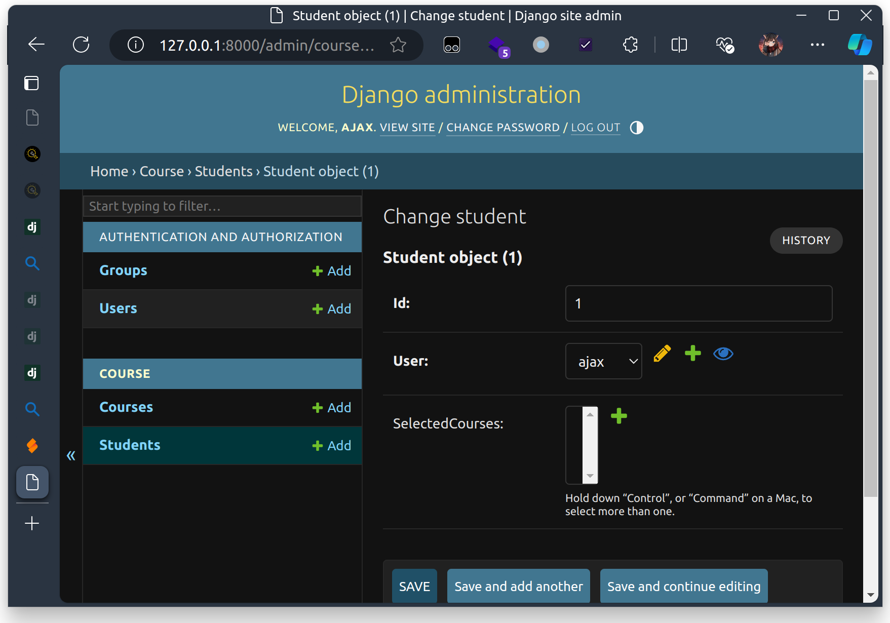

# Django

## 简要介绍

Django - The web framework for perfectionists with deadlines.

> Django is a high-level Python web framework that encourages rapid development and clean, pragmatic design. Built by experienced developers, it takes care of much of the hassle of web development, so you can focus on writing your app without needing to reinvent the wheel. It’s free and open source.

Django 框架是一个高级 Python Web 框架. Django 使你能够快速开发并设计出简洁优雅的 Web 应用, 避免自己造轮子. Django 还包含了大量的社区拓展插件, 以满足各种应用场景的需求.

理论上我应该在这里放一张 Django 的官网截图和链接, 但是 Django 官网的 Django 可能挂了 (怎么回事呢):

[www.djangoproject.com](https://www.djangoproject.com/)


## 项目架构

### 新建项目后的原始结构

在编写作业的 Repo 时, 我建了几个 commit. 在 `cbf610094cd18aef623f848460e40bc25d72ee02` 能看到项目刚刚建立时的目录结构.

为了新建一个 Django 项目, 我们需要使用 `django-admin` 命令 (装完 Django 就有):

```sh
django-admin startproject sast2024_django_hw
```

此时:

```sh
$ tree
.
├── manage.py
└── sast2024_django_hw
    ├── asgi.py
    ├── __init__.py
    ├── settings.py
    ├── urls.py
    └── wsgi.py

1 directory, 6 files
```

**`manage.py`** 是一个默认的命令行工具, 用于管理 Django 项目. 我们后面的乱七八糟的操作都是通过这个文件来进行的. 一般来说 **不需要改动这个文件**

**`sast2024_django_hw`** 是 Django **项目路径** 的名称, 与 `startproject` 指定的项目名称相同.

在项目路径下有 5 个文件;

`__init__.py` 是一个空文件, 用于标识该目录是一个 Python 包. 啥也没有, 不用管.

**`settings.py`** 是项目的 **配置文件**.

**`urls.py`** 是一个 **URL 配置文件**, 用于定义 URL 路由 (换句话说就是每一个 URL 应该由谁处理).

**`wsgi.py`** 是一个 WSGI (Web Server Gateway Interface) 应用程序, 用于 **处理同步请求**.

**`asgi.py`** 是一个 ASGI (Asynchronous Server Gateway Interface) 应用程序, 用于 **处理异步请求**.

**重要提示**: 如果要将 Django 应用用于生产环境, 请 **不要使用 `./manage.py runserver` 命令**, 请 **参考 [WSGI 部署方式](https://docs.djangoproject.com/en/5.0/howto/deployment/wsgi/) 或 [ASGI 部署方式](https://docs.djangoproject.com/en/5.0/howto/deployment/asgi/) 进行部署!!!**

再说一遍, 请 **不要使用 `./manage.py runserver` 命令**, 请 **参考 [WSGI 部署方式](https://docs.djangoproject.com/en/5.0/howto/deployment/wsgi/) 或 [ASGI 部署方式](https://docs.djangoproject.com/en/5.0/howto/deployment/asgi/) 进行部署**

### 新建应用后的结构

在创建项目之后, 可以使用 `./manage.py startapp app_name` 命令来创建一个应用. 查看 `68881b83dd439ee6bbae4bc73c593ab031bfc287` 可以看到在创建 `course` 应用之后的项目结构.

```sh
$ tree
.
├── course
│   ├── admin.py
│   ├── apps.py
│   ├── __init__.py
│   ├── migrations
│   │   └── __init__.py
│   ├── models.py
│   ├── tests.py
│   └── views.py
├── manage.py
└── sast2024_django_hw
    ├── asgi.py
    ├── __init__.py
    ├── settings.py
    ├── urls.py
    └── wsgi.py

3 directories, 13 files
```

`startapp` 命令创建了一个名为 `course` 的文件夹 (同样是 Python Module).

在这个文件夹中, 有以下文件:

**`admin.py`** 是一个用于 **管理后台** 的文件, 用于定义管理后台的模型和视图. 可以不用, 不过不得不说这玩意确实挺好用.

**`apps.py`** 是一个用于 **定义应用** 的文件, 用于定义应用的名称和配置 (不过我到现在为止似乎还没有用到过这玩意).

**`migrations`** 是一个用于 **数据库迁移** 的文件夹, 用于定义数据库的变更和版本控制. 一般来说这个文件夹里面的东西都是自动生成的; 但是有时候如果你有特殊的需求, 你也可以手动创建一些文件以获得对数据库迁移的精细化的控制.

接下来的 3 个文件是常用且重要的文件:

**`models.py`** 是一个用于 **定义模型** 的文件, 用于定义数据库的表结构和数据类型.

**`views.py`** 是一个用于 **定义视图** 的文件, 用于定义视图函数和视图类.

**`tests.py`** 是一个用于 **定义单元测试** 的文件, 用于定义测试用例和测试数据.

而实际上, **Django 项目的定义是十分灵活的**. 比如, 只要你在应用文件夹 (相当于应用这个 module 内) 任意位置定义了类 `AnyModel` (比如在 admin.py 里面)

```python
class AnyModel(models.Model):
    pass
```

在使用 `./manage.py makemigrations` 命令时都能被识别到.

```sh
$ ./manage.py makemigrations
Migrations for 'course':
  course/migrations/0002_anymodel.py
    - Create model AnyModel
```

而在任意位置定义函数 `def my_view(request): pass` 后, 都能把它作为一个视图函数注册到 URL 路由中.

但是, 这 **并不代表着你应该到处注册**. 建议对一个较为复杂的项目, 把 `views.py` 替换成 `views/` 目录, 把各种视图函数分门别类放在子文件里面. 对 `models.py` 和 `tests.py` 也是如此.

创建应用之后, 不要忘了在 `settings.py` 中注册应用 (我差点忘了写这句话了):

```python
INSTALLED_APPS = [
    ...
    'course'
]
```

## Django 中的 MVC

我们认为, MVC 中的 M 对应 `Model`, V 对应 `Template`, C 对应 `View`.


## Model 模型

模型, 也就是 Django 的数据库 ORM 框架.

> A model is the single, definitive source of information about your data. It contains the essential fields and behaviors of the data you’re storing. Generally, each model maps to a single database table.

Model 是后端的核心: **如何高效保存数据, 使得应用运行时的任意与数据库有关的操作的复杂度能控制在可以接受的范围内**

Django 支持 [多种数据库后端](https://docs.djangoproject.com/en/5.0/ref/databases/) (这不重要, 但也不一定不重要), 但 Django 做了大量的处理, 使得无论你用的是哪一种数据库, 你都能以同样的方式操作 Model, 由 Django 自动处理数据库的细节.

Django 的 Model 是一个 Python 类, 这个类继承自 `django.db.models.Model`, 并且这个类中的每一个属性都对应数据库表中的一个字段.

在 `019f0bc2e41079514dd62302f0248112ce3e06c5` 中, 可以看到我为小作业定义的初始字段:

```python
class Student(models.Model):
    id = models.CharField(max_length=10, primary_key=True)
    name = models.CharField(max_length=50)
    selectedCourses = models.ManyToManyField('Course', related_name='students')


class Course(models.Model):
    id = models.CharField(max_length=10, primary_key=True)
    name = models.CharField(max_length=50)
    teacher = models.CharField(max_length=50)
    department = models.CharField(max_length=50)
    time = models.CharField(max_length=50)
```

其中的 `CharField` 代表一个变长字符串, `max_length` 是这个字符串的最大长度, `primary_key=True` 代表着这是数据库的主键且具有唯一性. 在实际的数据库中, 这个字段会被存储为 `VARCHAR(max_length)`.

**但是**: 在 SQLite 中, 虽然 `id` max*length 是 10, 你依然可以存一个长度大于 10 的字符串进去而不引发错误. 但这并不代表着在 *任意\_ DB Backend 中都可以这样! 换句话说, Django 可能并不能完整校验你的数据, 导致你的代码在不同的数据库后端中可能会有不同的行为. 所以 **你需要在代码中显式校验你的数据**


`ManyToManyField` 代表一个多对多关系, `related_name` 是这个关系在另一个 Model 中对应的字段名. 这是由于 Python 具有十分 ~~(狗屎)~~ 灵活的对象机制, 以至于你可以在运行时动态地给对象插入一些属性. Django 还会对插入的属性做动态检查, 以确保不会有两个同名属性出现.

对于 Django 里面究竟有多少乱七八糟的字段, 请参阅 [Django Model Field Reference](https://docs.djangoproject.com/en/5.0/ref/models/fields/).

在完成字段定义之后, 可以使用 `Student.objects` 这个全局的对象来操作数据库. 这是一个 `<django.db.models.manager.Manager object at 0x7dd182ee0ec0>` 对象, 提供了增 (create) / 删 (delete) / 改 (update) / 查 (filter / get) 等等操作. 同时, 你也可以拿到实例之后和修改 Python 对象一样修改这个实例, 然后调用 `save()` 方法来保存修改.

```python
# Create
Student.objects.create(id='1', name='Ajax')

# or
stu = Student(id='1', name='Ajax')
stu.save()
# This line raises if the id (primary key) exists

# Query
Student.objects.filter(id='1')

# or
stu = Student.objects.get(id='1')
# This line raises if none match / multiple items match

# Update
Student.objects.filter(id='1').update(name='aJAX')
# Returns the number of items updated

# or
stu = Student.objects.get(id='1')
stu.name = 'Ajax'
stu.save()

# Delete
Student.objects.filter(id='1').delete()
```

更进阶的用法可以参考 [Django ORM](https://docs.djangoproject.com/en/5.0/topics/db/queries/). 我只想在此指出, 由于这些操作 **都是动态完成的** (IDE 没法帮你检查), 所以在更改 Model 的字段名称时, 需要格外小心检查是否所有静态和动态引用都得到了正确的更新.

### Migration

在 Django 中, 每次更改 Model 定义时, 都需要运行 `python manage.py makemigrations` 来生成 Migration 文件, 然后运行 `python manage.py migrate` 来应用 Migration 文件. 这是为了保证在项目开发的过程中, 数据库结构的变更能正确应用到生产环境的数据库中而不损坏数据.

Migration 文件中记录了 Model 的定义, 以及这个定义和上一个 Migration 文件中的定义之间的差异. 在运行 `migrate` 时, Django 会根据 Migration 文件中的定义来修改数据库结构.

在 `a4a230b57bccf7994b572664024f5434f7ead06f` 中, 我非常智障地发现我的 `Student` model 没有与 Django Session 的 User 做绑定. 因此就有了 `0002_remove_student_name_student_user.py` 这个文件, 我把 `name` 字段替换成了指向 `django.contrib.auth.models.User` 的 `ForeignKey` 字段.

在进行 migration 时, 由于一个是 name: CharField, 一个是 user: ForeignKey, 这两个没法直接迁移, user 也不能凭空生成, 所以 django 提示你需要手动指定一个值. 由于是测试环境, 我偷懒直接指定了 `None` (当时数据库里面啥也没有); 如果在生产环境中, 你就需要手动编辑 Migration 文件, 从 User 表里面找到合适的 (User 的 name 与 Student 的 name 相同) 的 User, 然后指定这个 User 作为 ForeignKey 的值.

通过 Migration, Django 提供了一种机制, 使得在项目开发的过程中, 数据库结构的变更能正确应用到生产环境的数据库中而不损坏数据. 这也是为什么 **你不应该把 migrations 文件夹加入 .gitignore**.

## Admin 管理面板

Django 提供了一个内建的管理面板以方便管理数据库中的数据.

通过一两句话

```python
from .models import Student, Course

admin.site.register(Student)
admin.site.register(Course)
```

你就可以在管理面板中对这些 Model 进行增删改查操作了. 但首先, 你需要用

```sh
./manage.py createsuperuser
```

来创建一个超级用户, 然后用这个超级用户登录管理面板.




Django Admin 可以让你在生产环境爆炸的时候迅速修数据库 (x)

## Routing 路由

在 Django 中, 路由是通过 `urls.py` 文件来定义的.

我们不妨切换到 `master` 分支上查看 `sast2024_django_hw/urls.py`:

```python
"""
URL configuration for sast2024_django_hw project.

The `urlpatterns` list routes URLs to views. For more information please see:
    https://docs.djangoproject.com/en/5.0/topics/http/urls/
Examples:
Function views
    1. Add an import:  from my_app import views
    2. Add a URL to urlpatterns:  path('', views.home, name='home')
Class-based views
    1. Add an import:  from other_app.views import Home
    2. Add a URL to urlpatterns:  path('', Home.as_view(), name='home')
Including another URLconf
    1. Import the include() function: from django.urls import include, path
    2. Add a URL to urlpatterns:  path('blog/', include('blog.urls'))
"""
from django.contrib import admin
from django.urls import path, include, re_path

from course.views import notFound

urlpatterns = [
    path('admin/', admin.site.urls),
    path('api/', include('course.urls')),

    re_path('.*?', notFound)
]
```

`urlpatterns` 是一个列表, 列表中的每一项都是一个 `path` 对象, `path` 对象定义了 URL 路径与视图之间的映射关系. Django 会 **顺序** 地对每一个请求进行匹配, 并返回第一个成功匹配的结果.

对于这个文件, 我们定义了三条路由:

1. `path('admin/', admin.site.urls)` 定义了访问 `/admin/` 时, Django 会调用 `admin.site.urls`, 进入标准的 Django Admin 管理面板.
2. `path('api/', include('course.urls'))` 定义了访问 `/api/` 时, Django 会调用 `course.urls`.
3. `re_path('.*?', notFound)` 定义了访问其他路径时, Django 会调用 `notFound` 这个视图, 展示 404 页面.

### URL 参数 / Body 参数的路由

我们的小作业中并没有涉及太多的 URL 参数和 Body 参数. 但是实际项目中这还是挺常见的.

Django 支持两种 URL 传参, 一种是通过 URL 的路径来传参, 一种是通过 URL 的查询参数来传参. 比如如果我希望管理员能单独查看每一个用户的选课情况:

```python
path('/admin/student/<str:student_id>/', views.studentCourseDetail)
```

其中的 `<str:student_id>` 代表着这个位置的参数会被 _按 keyword_ 传递给 `views.studentCourseDetail` 函数. 你可以在函数中通过 `student_id` 参数来获取这个参数.

而对于查询参数 (Query String), Django 会将查询参数解析为一个字典放在 `request.GET` 中. **注意! 就算是 POST 请求, 查询参数也在 `request.GET` 中**.

**对于 POST 请求**, Django 会根据 `Content-Type` 头来解析请求体. 对于 `application/x-www-form-urlencoded` 和 `multipart/form-data` 类型的请求, Django 会将请求体解析为一个字典放在 `request.POST` 中; 而对于其它类型的请求, Django (应该) 不会做处理.

对于 PATCH / PUT / DELETE 请求, Django **不会自动处理** 请求体.

还有几个需要注意的地方, 首先是 Django 不会自动处理 Options 请求, 你需要自己处理; 然后是当你 _第一次_ 访问 `request.POST` 时, Django 才会自动解析请求体 (也就是说, 这是一个懒加载的过程), 且如果自动解析失败, Django **会抛出异常**.

## View 视图

视图函数接受 `HttpRequest` 对象作为第一个参数, 可选地接受在 URL pattern 中的参数, 并返回一个 `HttpResponse` 对象.

但作为一个前后端分离的后端, 我们的每一个 Request 和 Response 都由 API 规范, 因此每一个函数都有大量的相同部分. 如, 处理 OPTIONS 请求; 校验登录的 User; 解析请求体中的 JSON 数据并验证格式; 将返回的错误信息和状态码返回给前端等等. 对于 **Class** 类型的视图, 我们通过创建 **基类** 来封装这些相同的部分; 而对于 **Function** 类型的视图, 我们通过创建 **装饰器** 来封装这些相同的部分.

### Decorator

**装饰器** 是一类函数, 它接受一个函数作为参数, 并返回一个新的函数. 装饰器可以用来修改函数的行为, 或者添加新的功能. 如:

```python
def log_return_value(base_func):
    def decorated(*args, **kwargs):
        result = base_func(*args, **kwargs)
        print(f"Return value: {repr(result)}")
        return result
    return decorated
```

实现了用原参数调用 `base_func`, 并在返回前打印返回值的功能.

此时调用

```python
@log_return_value
def add(a, b):
    return a + b

c = add(1, 2)
```

会在 c 赋值前打印 `Return value: 3`.

**装饰器函数也可以是函数的返回值** - 这给装饰器增加了更多的灵活性 (也更难懂了). 查看 `course/wrapper.py`, 里面就定义了 `api` 装饰器, 它会自动处理 OPTIONS, 检查 Method, 验证 Session, 解析请求体, 并将错误信息和状态码返回给前端.

但是需要注意的是, **装饰器可能会影响 IDE 对函数应该接受什么参数和返回什么值的判断**.

### API

在有了装饰器之后, API 就更容易写了, 你只需要注意检查 data, 返回正确的数据即可. 比如以下函数

```python
@api(allowed_methods=["GET"])
def listSelectedCourses(user: User, **kwargs):
    """List all selected courses for the current user

    Parameters:
        user (User): The current user object, auto-filled by @api decorator.

    Returns:
        `data` contains a list of selected courses in JSON format. Example: [{
            "id": "PKU009",
            "name": "History of Chinese Economic Thought",
            "teacher": "Prof. Zhou Jianbo",
            "department": "Economics",
            "time": "Thu 08:00-10:00"
        }, ...]
    """

    return [{"id": c.id, "name": c.name, "teacher": c.teacher, "department": c.department,
             "time": c.time} for c in Student.objects.get(user=user).selectedCourses.all()]
```

接受已经登陆用户的 GET 请求, 由 `@api` 装饰器解析出 user, 将 `Student.objects.get(user=user).selectedCourses.all()` 的每一条结果转换为 dict, 拼接成列表并返回给 `@api` 装饰器, 由 `@api` 装饰器生成符合 API 规范的 JSON 数据并返回给前端.

对于较为复杂的 Model, 个人推荐把每一个 Field 的验证逻辑 / Model 到 JSON 的转换逻辑都放在 Model 中, 统一管理.

## Tests

Django 自带测试框架用于测试 Model 和 View. 你可以通过 django.test.TestCase 类与 django.test.Client 类来模拟前端与开发工程师所撰写的后端交互 (黑盒测试), 也可以直接调用 Model 的方法向测试数据库写东西, 以检查 View 的行为 (白盒测试).

一般来说, 与一个功能有关的测例集中于一个 `django.test.TestCase` 子类中, 通过重载 `setUp` 方法初始化测试环境, 所有以 `test` 开头的方法会被认为是测例, 在测例中通过 `self.assert*` 方法检查测试结果, 通过 `tearDown` 方法清理测试环境.

测试在 Django 的代码里面占了相当大的比例 (甚至 50%). 你或许可以看看我 [软工大作业的测试](https://github.com/84634E1A607A/nova210se_backend/blob/master/main/tests).

## Template 模板

由于是前后端分离的架构, 所以 Template 我们实际上用不到. 如果你想了解, 可以参考 [Django Template](https://docs.djangoproject.com/en/5.0/topics/templates/).
